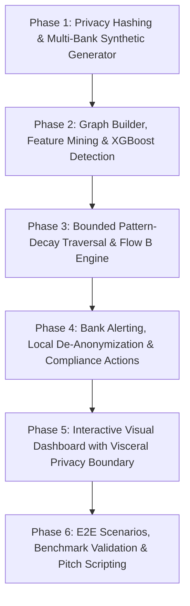

# Cross-Bank Mule Account Detection Network - Implementation Plan

> **Goal:** Build a privacy-preserving cross-bank fraud intelligence platform that detects distributed money mule rings and fast laundering chains across multiple banks without centralizing raw PII or raw transaction databases.  
> **Architecture:** A modular Python backend (FastAPI, NetworkX, Scikit-learn/XGBoost, SHAP, HMAC cryptography) coupled with an interactive React Flow graph visualizer. Operates in two distinct modes: **Flow A** (Continuous boundary-crossing edge ingestion, graph construction, structural feature extraction, XGBoost mule scoring) and **Flow B** (Triggered deep-dive investigation with ephemeral salts and bounded pattern-decay traversal).  
> **Tech Stack:** 
> - **Backend:** Python 3.11+, FastAPI, NetworkX, Pandas, NumPy, Scikit-Learn, XGBoost, SHAP, PyCryptodome / `hashlib` (HMAC-SHA256), Pytest.
> - **Frontend:** React 19 / Vite, TypeScript, Tailwind CSS, Lucide React, **React Flow (`@xyflow/react`)** for high-performance React-native interactive graph topologies.
> **Spec Reference:** [Cross-Bank-Mule-Detection-Documentation (1).md](file:///c:/Users/HP/Desktop/CSI%20origins/Cross-Bank-Mule-Detection-Documentation%20(1).md)

---

## Global Constraints & Guiding Principles
1. **Strict Privacy Architecture & Visceral UI Boundary**: Zero raw PII (Account Number, IFSC, PAN, Aadhaar, Name) stored or visible centrally. The Central Ops Dashboard *only* renders cryptographic node hashes (`HMAC:...`), structural topologies, and bank tags. Real customer identities are *only* visible inside the distinct **Bank Compliance Portal** simulating the bank's internal intranet.
2. **Explainability First**: Every detected mule flag must output an exact subgraph evidence trail and SHAP feature attribution (pass-through ratio, hops, velocity, behavioral mismatch).
3. **Decoupled Scopes**: Flow A (Edge Sharing + Graph Mining) is the core MVP deliverable; Federated Learning (§3.9) and Private Set Intersection (§4.1) are positioned as architectural roadmap targets.
4. **Honest Technical Framing**:
   - **Synthetic ML Validation**: High precision/recall on synthetic injected motifs validates end-to-end pipeline integrity, feature sensitivity, and SHAP attribution consistency — not real-world out-of-distribution generalization.
   - **Performance Scale**: Sub-50ms query benchmarks validate prototype in-memory algorithmic efficiency at demo scale (~10k edges), clearly decoupled from national-scale distributed stream processing architectures.
5. **Committed UI Stack**: React Flow for graph topology rendering; Streamlit fallback prepared for time constraints.

---

## Phase Breakdown Overview

| Phase | Scope & Deliverables | Status / Focus |
|---|---|---|
| **Phase 1** | Project scaffold, HMAC-SHA256 privacy engine, Erdős-Rényi synthetic multi-bank transaction generator with injected mule motifs (chains, stars, structuring). | Foundation |
| **Phase 2** | NetworkX temporal graph builder, structural + behavioral feature extractors (velocity, pass-through, fan-in/out), XGBoost classifier, SHAP explainability engine. | Core Analytics |
| **Phase 3** | Flow B scoped neighborhood engine, pattern-decay traversal algorithm, safety caps (hops, bank budget), ephemeral investigation hashing. | Deep Investigation |
| **Phase 4** | Simulated participating bank nodes (HDFC, SBI, ICICI, Axis, PNB), alert dispatch protocol, bank-local de-anonymization lookup, STR report generator. | Bank Integration |
| **Phase 5** | High-impact interactive UI with real-time multi-bank transaction visualizer using React Flow, mule ring highlighter, SHAP radar charts, and bank investigation terminal with strict visual airgap. | Visualization & UI |
| **Phase 6** | E2E test suite, precision/recall benchmark validation, ready-to-run demo scenarios (5-bank chain, collector ring, decay boundary test), and calibrated pitch script. | Polish & Demo |

---

## Phase 1: Privacy Engine & Synthetic Multi-Bank Data Generator

### Scope
1. Scaffold Python backend and FastAPI services.
2. Implement the dual-tier HMAC-SHA256 privacy module:
   - **Standing rotated key** for Flow A continuous monitoring (`node_id = HMAC-SHA256(registry_key, account + IFSC)`).
   - **Ephemeral one-time salt** for Flow B targeted investigations (`investigation_id = HMAC-SHA256(investigation_salt, account + Bank_ID)`).
   - **Zero-persistence guarantee** (stateless hashing microservice, no raw PII stored centrally).
3. Build a multi-bank synthetic data engine using Erdős-Rényi base graphs with realistic Indian banking parameters (IFSC codes, account numbering, transaction amounts, timestamps).
4. Inject ground-truth labeled mule motifs:
   - **Chains**: 2–7 hops across multiple banks with short time intervals and near 1.0 pass-through ratio.
   - **Collector Star**: Many fan-in accounts funneling into one aggregator within an hour.
   - **Distributor Star**: One collector dispersing funds into many fan-out accounts.
   - **Structuring**: Amounts just under reporting limits (e.g. ₹49,500).

### Files to Create:
- `backend/app/config.py` - Core configuration and secrets rotation intervals
- `backend/app/privacy/hashing.py` - HMAC-SHA256 standing and ephemeral hashing functions
- `backend/app/privacy/bank_vault.py` - Bank-side local identity storage and hash mapper (air-gapped)
- `backend/app/data_generator/synthetic_banks.py` - Bank metadata, IFSC registry, account generator
- `backend/app/data_generator/motif_injector.py` - Normal Erdős-Rényi traffic + labeled mule motif injection
- `backend/tests/test_privacy.py` - Cryptographic verification tests
- `backend/tests/test_synthetic_generator.py` - Data generation and motif structure tests

---

## Phase 2: Graph Builder, Structural Feature Engineering & ML Detection Engine

### Scope
1. Build the Central Graph Ingestion Engine to convert flat inter-bank edge streams into directed multi-edge temporal graphs using NetworkX.
2. Implement graph feature extraction:
   - **Pass-through ratio**: `amount_sent_within_N_hours / amount_received`
   - **Temporal velocity**: Delta time between incoming and outgoing edges
   - **Fan-in / Fan-out asymmetry**: In-degree vs out-degree counts and volume distributions
   - **Cycle / Path length**: Directed shortest paths and motif signatures
   - **First-time edge detection**: Historical transaction lookup flag
   - **Bank Behavioral Risk**: Account age mismatch, reactivation flag, round figures, structuring
3. Connected Component & Subgraph extraction.
4. Train XGBoost / Random Forest classifier on labeled motifs.
5. Implement SHAP explainability engine to output human-readable reasons (e.g., "Pass-through 94%, 4-hop chain spanning 3 banks, 35 min window").

> [!NOTE]
> **Judge Calibration Note (ML Validation):**  
> On synthetic data with injected motifs, high precision/recall validates our end-to-end pipeline integrity, topological feature extraction, and SHAP explainability mechanics. In the pitch, state explicitly: *"This validates our mathematical feature extractor and pipeline end-to-end; production deployment would be calibrated against real bank STR datasets."*

### Files to Create:
- `backend/app/graph/graph_engine.py` - Central NetworkX temporal graph builder
- `backend/app/features/feature_extractor.py` - Structural and behavioral metrics calculator
- `backend/app/ml/classifier.py` - XGBoost / Random Forest training, scoring, and thresholding
- `backend/app/ml/explainability.py` - SHAP values and natural-language rationale generator
- `backend/tests/test_graph_engine.py` - Graph construction and edge querying tests
- `backend/tests/test_feature_extractor.py` - Metric calculation tests
- `backend/tests/test_ml_detection.py` - Classifier accuracy and SHAP output tests

---

## Phase 3: Bounded Graph Traversal & Targeted Investigation Flow (Flow B)

### Scope
1. Implement the Bounded Graph Traversal Algorithm:
   - **Pattern-decay stopping rule**: Traverses bidirectionally (upstream towards victim, downstream towards cash-out). Evaluates edge features at each hop; halts traversal if pass-through decay falls below threshold or historical relationship exists.
   - **Hard safety caps**: Enforce max hop depth (5-7 hops), max participating banks (10-15), and neighborhood pull request quota.
2. Build Flow B Scoped Neighborhood Pull orchestration:
   - Generate ephemeral case salt on demand.
   - Query simulated bank intra-bank edge cache for targeted node.
   - Reconstruct localized investigation subgraph.
   - Destroy ephemeral salt upon investigation completion.

### Files to Create:
- `backend/app/investigation/traversal.py` - Pattern-decay bidirectional graph traversal engine
- `backend/app/investigation/flow_b_service.py` - On-demand scoped pull coordinator with ephemeral hashing
- `backend/tests/test_traversal.py` - Traversal decay and hard-cap termination tests
- `backend/tests/test_flow_b.py` - Ephemeral lifecycle and scoped pull tests

---

## Phase 4: Bank Alerting, Local De-Anonymization & Regulatory Reporting

### Scope
1. Build Bank Simulation Clients (State Bank of India, HDFC Bank, ICICI Bank, Axis Bank, Punjab National Bank) with isolated local storage.
2. Central Alert Dispatcher: When a component crosses risk threshold, dispatch alerts containing:
   - Hashed account IDs of the bank's involved nodes
   - Risk probability score & component topology
   - SHAP explanation summary
3. Bank-side De-Anonymization & Action Engine:
   - Bank receives alert $\rightarrow$ resolves hash using internal local vault $\rightarrow$ returns real account record for compliance officer.
   - Generates simulated Suspicious Transaction Report (STR) payload for FIU-IND / IDPIC format.
   - Recommends automated actions (Debit Freeze, Temporary Lien, Manual Review Escalation).

### Files to Create:
- `backend/app/bank_node/bank_client.py` - Bank node interface, local key store, and de-anonymization handler
- `backend/app/alerts/dispatcher.py` - Central alert routing to participating bank endpoints
- `backend/app/compliance/str_generator.py` - FIU-IND / IDPIC STR report schema and generator
- `backend/tests/test_bank_alerting.py` - End-to-end alert dispatch, local de-anonymization, and STR output tests

---

## Phase 5: Interactive Visual Dashboard & Graph Visualizer

### Scope
1. Scaffold modern Vite + React 19 + TypeScript + Tailwind CSS web application.
2. Build two distinctly styled portals to visually enforce the privacy boundary:
   - **Portal 1: Central IDPIC/Intelligence Console (Zero PII)**:
     - **Global Network Radar**: Real-time multi-bank transaction graph in React Flow with color-coded bank clusters, animated edge pulses, zoom/pan, and node selection.
     - **Mule Ring Detection Panel**: Live list of flagged components showing *only* cryptographic hash identifiers (e.g. `HMAC:8f9a...`), risk probability scores, bank tags, and severity badges.
     - **Subgraph Deep-Dive Explorer**: Interactive React Flow canvas for detected rings with custom node cards, hop filters, pass-through overlays, and edge details.
     - **Explainability Drawer**: SHAP feature importance charts, velocity breakdown, and plain-English summary.
     - **Flow B Investigation Workbench**: Interactive step-by-step playback of pattern-decay traversal.
   - **Portal 2: Bank Compliance Intranet Terminal (De-Anonymization View)**:
     - Visually distinct UI (e.g., "State Bank of India - Internal AML Portal") demonstrating the receiving of a central alert.
     - Interactive **"Decrypt / Resolve Local Identity"** trigger: Demonstrates the bank's internal database matching `HMAC:8f9a...` to real customer details (`Rajesh Kumar`, `Acct: 40991209384`, `KYC: Verified`, `Declared Income: ₹25k/mo`).
     - One-click FIU-IND STR report exporter and account freeze simulator.
3. Fast REST / WebSocket endpoints in FastAPI to connect UI with backend.

> [!TIP]
> **What If We Run Out of Time? Fallback Plan:**  
> If UI development exceeds time budget, deploy a minimal Streamlit dashboard with Matplotlib/NetworkX static graph visualizations. This ensures a working demo even without the full React frontend.

### Files to Create:
- `frontend/src/App.tsx` - Main layout with dual-view toggle (Central Intelligence vs. Bank Intranet)
- `frontend/src/components/NetworkGraph.tsx` - Interactive multi-bank topology visualizer using React Flow
- `frontend/src/components/AlertTable.tsx` - Flagged mule rings with anonymized hash IDs and bank breakdown
- `frontend/src/components/ExplainabilityView.tsx` - SHAP factor radar and narrative breakdown
- `frontend/src/components/InvestigationWorkbench.tsx` - Flow B decay traversal interactive explorer
- `frontend/src/components/BankCompliancePortal.tsx` - Bank-internal de-anonymization and STR generator UI
- `backend/app/api/routes.py` - FastAPI endpoints for simulation control, graph data, alerts, and investigations
- `backend/streamlit_app.py` - (Fallback) Standalone Streamlit dashboard with NetworkX visualizations

---

## Phase 6: E2E Scenarios, Benchmark Validation & Pitch Scripting

### Scope
1. Pre-package 4 deterministic demo scenarios:
   - **Scenario 1 - Fast 4-Bank Rapid Chain**: ₹5,00,000 laundering chain across 4 banks within 45 minutes with 98% pass-through.
   - **Scenario 2 - 8-Account Collector Star**: 8 compromised accounts sending ₹50,000 each to 1 central collector within 2 hours.
   - **Scenario 3 - Distributor & Smurfing Ring**: 1 hub splitting funds into 10 structured transfers just below ₹50,000 reporting threshold.
   - **Scenario 4 - Traversal Decay Test**: Legitimate business account receiving funds and holding them for days, proving that traversal safely halts and avoids false positives.
2. Performance & Privacy Audit: Validate that no raw PII exists in central database; measure in-memory prototype traversal latency (<50ms for 10k edges).
3. Scripted Demo Walkthrough & Pitch Deck Calibration.

---

## Verification Plan

### Automated Tests
- **Crypto & Privacy**: `pytest backend/tests/test_privacy.py` (Verify HMAC consistency, key rotation isolation, ephemeral salt destruction).
- **Synthetic Data**: `pytest backend/tests/test_synthetic_generator.py` (Verify Erdős-Rényi baseline and motif generation).
- **Graph & Features**: `pytest backend/tests/test_graph_engine.py test_feature_extractor.py` (Verify pass-through ratios, temporal metrics, chain detection).
- **ML & Explainability**: `pytest backend/tests/test_ml_detection.py` (Verify pipeline detection sensitivity and SHAP output validity on synthetic ground truth).
- **Traversal & Traversal Decay**: `pytest backend/tests/test_traversal.py` (Verify pattern-decay stopping rule and hard caps).
- **Bank De-Anonymization**: `pytest backend/tests/test_bank_alerting.py` (Verify alert dispatch and bank-isolated identity resolution).

### Manual Verification
- Start FastAPI backend (`uvicorn backend.app.main:app --reload`) and Frontend (`npm run dev`).
- Run interactive simulation trigger from UI and verify real-time graph visualization in React Flow.
- Verify Central Dashboard strictly displays anonymized node hashes (`HMAC:...`) and zero customer PII.
- Switch to the Bank Compliance Portal in the UI and demonstrate local de-anonymization and STR generation.
- Verify fallback Streamlit dashboard runs cleanly via `streamlit run backend/streamlit_app.py`.
